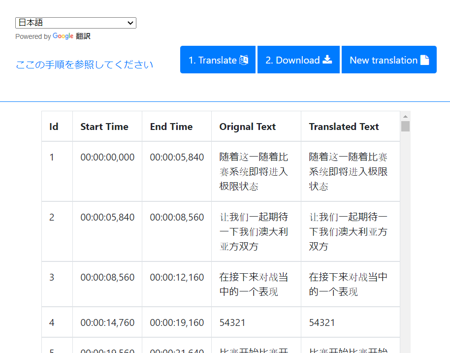

# bilibili (゜- ゜)つロ 乾杯~  
中国の動画配信サービス。大陸のチームや公式の動画はほぼここにしかない。見に行こう  
ちなみに大会のライブは最新の物は[公式ページ](https://www.robomaster.com/live)でも見れるが、基本的にbilibiliの方が通信が早い。公式ページのメリットはトーナメント表などを見れること。  

## 動画のダウンロード  
bilibili動画のダウンロードには[ここ](https://xbeibeix.com/api/bilibili/)がおすすめ。
URLを入力して、アルファベット2文字を読み取って入力すると下の方にダウンロードリンク等が出てくる。  
他のサイトもあるけど、高画質でダウンロード出来るのはここ以外知らない(ここも潰れるかも知れないので、他にあれば教えて...)  

## 動画の翻訳  
bilibiliで拾ってきた大会動画から字幕を付けて翻訳する流れ  
GoogleのColaboratoryとOpenAIのWhisperとTranslating Subtitlesってのを使ってる  
現地実況を聞きながら大陸の試合を見て勉強しよう！  
1. 動画をmp3ファイルに変換する  
    使うソフトは何でも良いけど、個人的おススメは[XMedia Recode](https://www.xmedia-recode.de/en/)  
2. Googleドライブにアップロードする  
    ドライブ直下にmp3フォルダを作成し、その中にmp3ファイルを全てアップロードする  
      
3. GoogleColaboratoryにアクセスする  
    [Whisper.ipynb](https://colab.research.google.com/drive/1EJDNLdTFwexdCZGihPKWHrE5K1tpQ5ci?usp=sharing)を開く  
    一番上のセルから実行していく。  
    2つ目のセルでGoogleドライブのマウント許可を聞かれるので、mp3ファイルをアップロードしたアカウントでログインし許可する。  
4. 文字起こしする  
    3つ目のセルを実行する。一行目が英語、二行目が中国語用となっているので該当する方の先頭の"#"を外して実行する。  
      
    文字起こしの結果が出力され、一つのファイルが完了するとGoogleドライブのmp3フォルダ内にデータが保存されていく  
      
    この中のsrtファイルをダウンロードする  
    大体１地区(10~15分の動画x50本)で3時間くらいかかる。  
5. 文字起こししたsrtファイルを翻訳する  
    [Translating Subtitles](https://translatesubtitles.co/)にアクセスし、日本語訳したいsrtファイルをドラッグドロップでアップロードする  
    画面左上の翻訳先の言語から日本語を選び1.Translateを押下すると日本語訳される。  
      
    2.Downloadを押下すると翻訳されたsrtファイルがダウンロードできる、以下繰り返し  
6. 使い方
    字幕ファイルを読み込めればなんでも良い、以下はおススメのプレイヤーたち  
    - Windows  
        恐らく一通りのプレイヤーで対応してると思うけど、メディアプレーヤーで動画を再生する。  
          
        右下の字幕から該当の字幕ファイルを選ぶ。  
    - Android  
        [XPlayer](https://play.google.com/store/apps/details?id=video.player.videoplayer&pcampaignid=web_share)が個人的にはおススメ  
    - iOS  
        [VLC media player](https://apps.apple.com/jp/app/vlc-media-player/id650377962)だと字幕ファイル読みだせるらしい  

## リンク集  
[bilibiliトップページ](https://www.bilibili.com/)  

[RoboMaster公式](https://space.bilibili.com/20554233?spm_id_from=333.337.search-card.all.click)  
[youtubeでいうプレイリスト(各地区の試合とかがまとまってる)](https://space.bilibili.com/20554233/channel/series)  

[動画審査系](https://space.bilibili.com/3493132033330101/favlist?fid=2549982301&ftype=create)  

