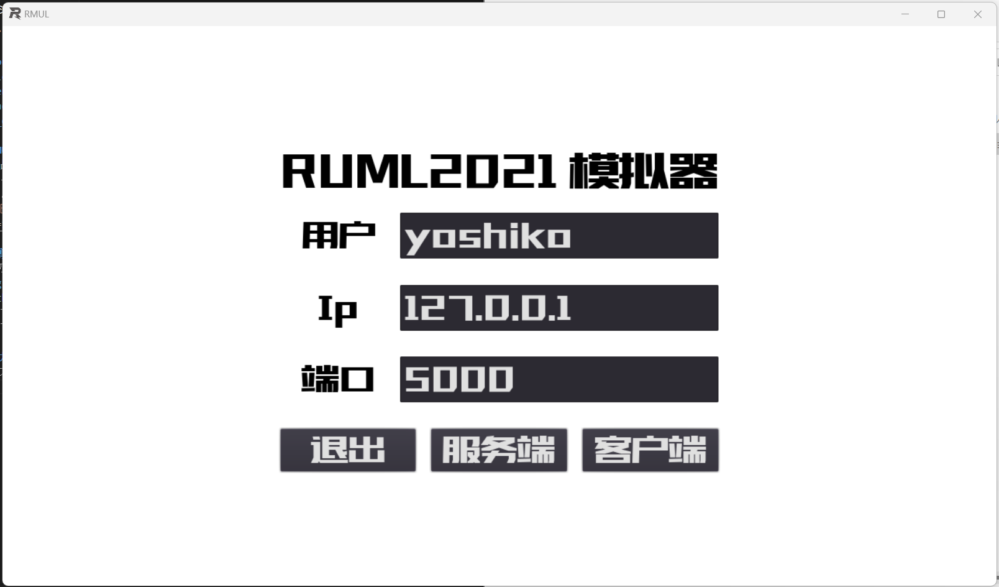
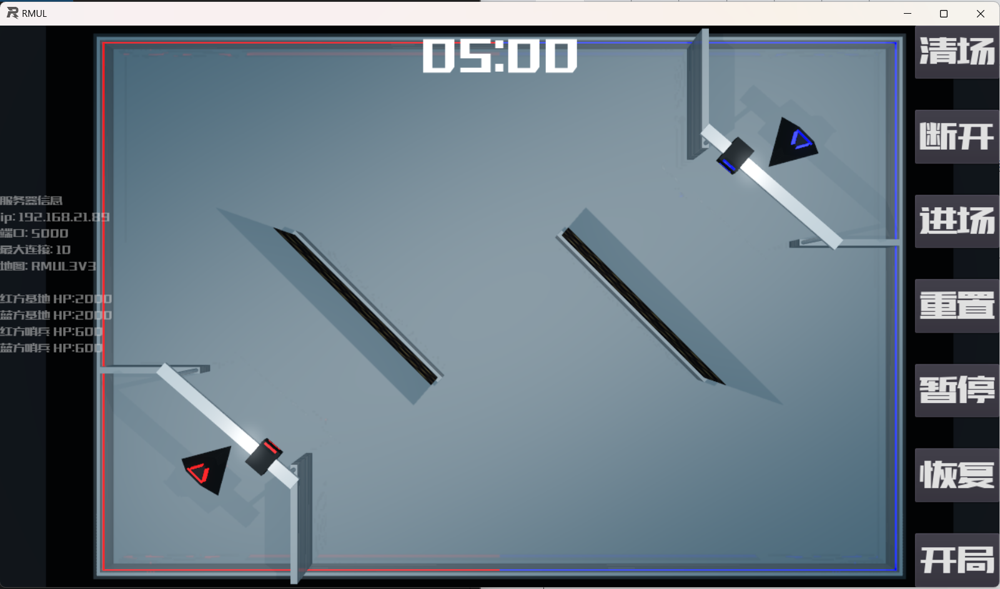
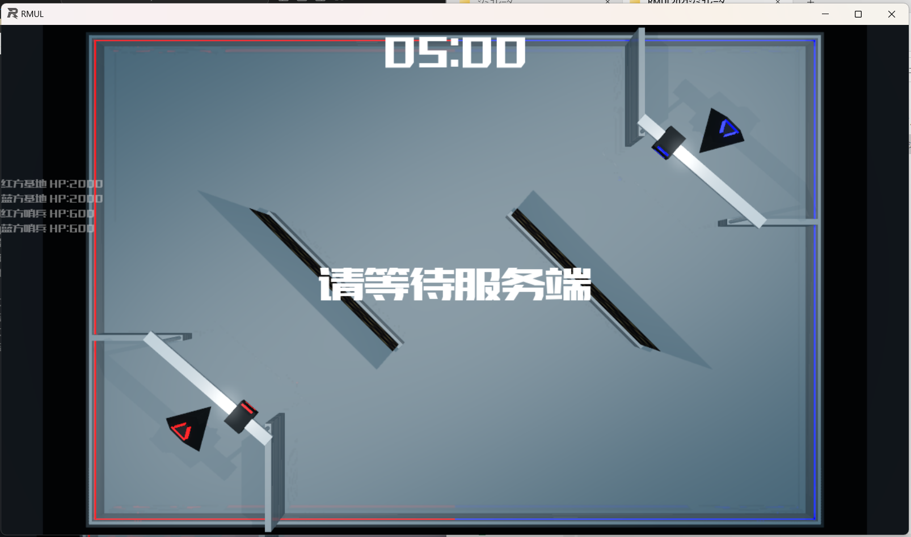
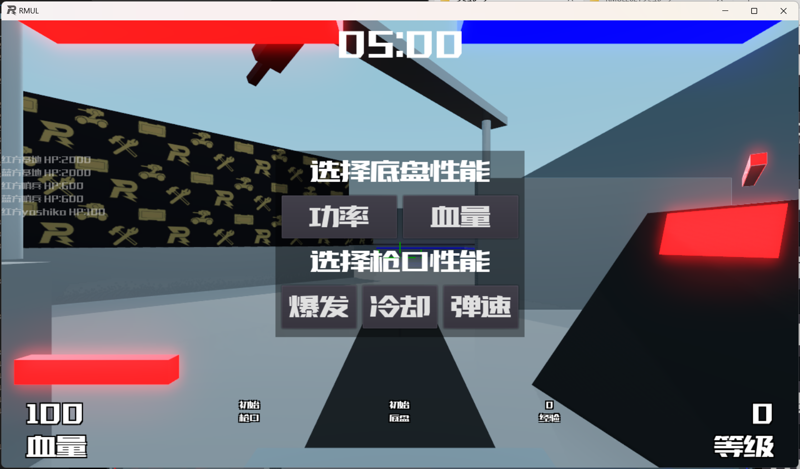
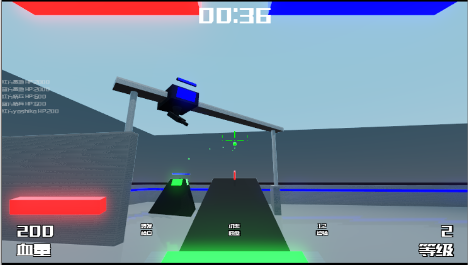

# RMUL2021シミュレータ  
醒狮战队が正式名称っぽい、非公式のRMUL2021シミュレータ  
ファイルが軽い(脅威の36MB未満)、動作も軽い、哨兵が自動で動いてくれる、簡単な操作練習や戦略を立てるとかには使えそう  
[詳細はここ](https://bbs.robomaster.com/forum.php?mod=viewthread&tid=11927)  

## 導入  
bbsの下の方にあるダウンロードリンクからダウンロードして解凍する  
  
解凍するとexeファイルが一つ出てくる。このファイルからサーバーもクライアントも起動できる  

## サーバーを立てる  
exeファイルを起動する  
  
上から名前、IPアドレス(複数人プレイする場合はサーバーを起動するPCのIPアドレスにする)、ポート(デフォルト5000)を選んで中央下の服？端を選択する  
  
画像のように表示されたら成功。右側のボタンは上から  
- リセット
- ホームに戻る(参加してるクライアントも強制的に戻る)  
- クライアントにロボットを選択させる  
- 効果は不明  
- 効果は不明  
- 効果は不明  
- 試合開始  

となっている。  
基本的な流れはサーバーを立てる->ユーザーが入る->ロボットを選択させる(選択するとフィールド上にスポーンする)->試合開始する  

## クライアントを立てる  
起動するとサーバーと同じ画面になるので、サーバーと同様に3つの項目を入力して客戸端を選択する  
  
画像の様に表示されたらOK。サーバーからロボットの選択や試合開始されるのを待つ。  

## 試合の動き  
ロボットの選択を行うor試合が開始されると画像の様にロボットのモードを選択できるようになる  
  
それぞれ1つずつ選ぶことで表示が消え動くことが出来る  
基本的な操作方法  
- wasd 移動
- 左クリック 単発射撃
- 右クリック 連発射撃
- Q 射撃有効化
- E 無限回転
- Shift+E 無限回転停止  

  
哨兵はレール時代のが動いています(攻撃はしてこない)  
バーチャシールド的なのも実装されてる  
弾の補給はなし(なので復活したら即打てます)  

## 不具合とかそのほか  
- 試合開始前にロボットのモードを選んでも上手く動かないことがある  
    ->試合開始(カウントダウン後)してからロボットのモードを選択すると良い  
- VPN接続で試合をするとかくかくする  
    有線のPC同士だと上手く動く説もあり  
    瞬間移動してしまうので、試合にはならない...  