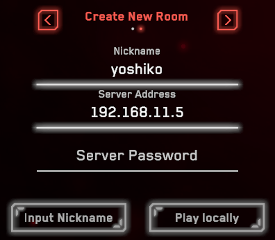

# SimulatorX  
華南理工大学の製作しているシミュレータ、とりあえず知る限り最強  

## ToDo  
- [ ] 操作対応表を作成する  
- [ ] サーバー落ちの原因解明  
- [x] 歩兵の種別の意味を知る  
- [ ] 金銭の設定の意味を知る  
- [x] RMUL2023もプレイできるようになりたい  
- [ ] 記事が長すぎる気がするので、ULとUCで分けたいかも  

## 各種リンク  
しっかり読めればこれらから全てを理解できるはず  
[2023公式ページ](simulatorx.org)  
[2022公式ページ](https://sim.scutbot.cn/)  
[githubリポジトリ](https://github.com/scutrobotlab/RM2022_SimulatorX)  
[説明資料](https://scutrobotlab.feishu.cn/wiki/wikcnqYPJumnro3Mro0WRp3NUkd)  
[ダウンロードサイト](https://dl.sim.scutbot.cn/)  

## RMUC2023の導入  
### クライアントの導入  
[2023公式ページのインストール](https://simulatorx.org/guide/install.html)からSimulatorX Windows Clientを押下しクライアントをダウンロードします。  
  
2023-10-02現在では"SimulatorX-Windows-Client-1.2.3.1-Release"がダウンロードされます。(リンク集にあるダウンロードサイトにはないバージョンです)  
これをPC上の任意の場所に解凍します。  
後はダブルクリックで起動が出来ます。最初の起動時に警告とファイアウォールの設定が出るので全て許可します。   
  
任意のキー入力を求められた後、画像の様なメイン画面が表示されます。  
右上の歯車から設定を変更でき、言語を英語にしたり、フルスクリーンにしたり、操作方法の変更が出来ます。  
  

### 一人でローカルプレイをする場合  
まずクライアントを起動します。 
個人プレイする場合はNicknameのみ(中国語だと用戸名)を入力し、Play locallyを選択します。  
  
ローカル用のルームが表示されます。  
#### ルームでの操作  
基本的には各ロボット、もしくは審判が観客を選択し、左上のStartを押下することで試合に参加することが出来ます。  
歩兵のみ種別があり、ロボットの隣にある横三角形を押下することで選択することが出来ます。  
  
左から脚なしバランシング歩兵、脚ありバランシング歩兵、4輪バランシング歩兵、4輪歩兵です。  
4輪バランシングのみが完全にサポートされているバランシング歩兵で、それ以外のバランス歩兵は8台以上になると激しいラグが発生するらしいです。  
また、中央上部からマネーの設定が出来ます。  
  
これが増える量なのか初期値なのかは不明です。  
#### 試合での操作  
ルーム画面でStartを押下するとフィールドに移動します。  
フィールドに移動したらPキーを押してロボットのタイプを設定します。これをしないと弾の購入等が出来ないようです。  
  
基本的な操作は[説明資料の操作方法ページ](https://scutrobotlab.feishu.cn/wiki/XoYjwiKk7if73qksRSscpLUSnqf)にあります。  
最低限の操作方法(歩兵&ヒーロー)  
- 移動 wasd
- Y or Shift 無限回転  
- C キャパシタモード  
- B 照準モード？  
- O 弾購入(大会仕様)  
- X 後ろを向く  
- H 単発と連射を切替  
- 左クリック 射撃  
- 右クリック 自動照準  

自由に練習できると思います  
  

試合から抜けるにはPキーを押下してlogoutを選択するとメイン画面に戻れます。

### サーバーの導入  
複数人でプレイするために必要となります。  
[2023公式ページのインストール](https://simulatorx.org/guide/install.html#%E6%9C%8D%E5%8A%A1%E7%AB%AF%E8%BD%AF%E4%BB%B6)から今度はSimulatorX Windows Serverをダウンロードし任意の場所に解凍をしてください。  
これも起動時に警告とファイアウォールの設定が出てくるので全て許可します。  

### サーバーの起動  
解凍したサーバーフォルダ内の"simulatorx-server.exe"をダブルクリックで起動します。  
サーバーを起動するPCはクライアントと同じネットワークに接続する必要があります。(クライアントを実行するPCと同一のPCでも問題ありません)  
また、この際サーバーを実行しているPCのIPアドレスを控えておきます。クライアント側で必要になってきます。  

### 複数人でプレイする場合  
#### 部屋を立てる人  
サーバーの起動を先に済ませておきます。  
メイン画面のCreate New RoomにNicknameとServer Addressを入力し、Input Nicknameを選択します。  
  
正常にルームが作成されると左上にトークンが表示されるのでこれをルーム参加者に伝えます。  
  
その他の操作はローカルと同じです。  
#### 部屋に参加する人  
メイン画面でJoin Exist RoomからNickname、Server Address、Server Tokenをそれぞれ入力します。  
  
同じルームに入れるので、ロボットを選択し、ルーム作成者がマネーの設定をしたり試合を開始するのを待ちましょう。  

#### 複数人プレイで発生している現象  
ルームを立てた人がLeaveした場合、試合が終了して数十秒後などにサーバーが異常終了します  
終了すると再度起動しなくては行けない他、偶に何度再起動してもクラッシュすることがあります。  
原因は不明ですが、試合の度にサーバーを立て直し、クラッシュするようになったら改めてサーバーを解凍することで解決できます。  

## RMUL2023の導入  
### クライアントの導入  
[ダウンロードサイト](https://dl.sim.scutbot.cn/SimulatorX%20%5B2023UL%5D/)からSimulatorXInstaller_1.1.1.7_Beta.exeをダウンロードし実行するとインストールできます。zip版をダウンロードして解凍しても良いです。  
起動時の警告やファイアウォールはUC版と同様にすべて許可します  
### サーバーの導入  
RMULのサーバーだけubuntu20.04で動作させています。  
詳細は[ここ](https://scutrobotlab.feishu.cn/wiki/wikcnRiq42a2Q1RJ23UlFrJZsfb)  

以下、特に明記しないものは全てbash   
```sh
#dockerのインストール
sudo apt update
sudo apt install -y docker-compose
#サーバー用フォルダ作成  
mkdir ~/SimulatorX
cd ~/SimlatorX
#dockerの設定ファイル記述
vi docker-compose.yml
```
docker-compose.ymlの中身  
```yml
version: "3"
services:
  SimulatorX-2023ul:
    container_name: SimulatorX-2023ul
    image: scutrobot/2023ul:beta-1.1.1.7
    volumes:
      - ./config:/root/config
      - ./log:/var/log/simulatorx
    restart: always
    network_mode: "host"
```
imageは[ここ](https://scutrobotlab.feishu.cn/wiki/wikcnWpFhzcVz9i1xHb0hoXKWWc)とかを参照  
```sh
#コンフィグの作成
mkdir ~/SimulatorX/config
vi ~/SimulatorX/config/config.yml
```
config.yml 中身
```yml
domain: 192.168.11.5
server_name: example_server
rooms:
  default:
    port:
      - 5333-5334
    name: "example_room"
    password: "423987"
```
domainにはPCのIPアドレスを入力、パスワードはクライアントがルームに入る際に用いるものとなる。ちなみにdomainは全く違うIPでも動作を確認した。詳細は不明  
```sh
#コンテナ立ち上げ
sudo docker-compose up -d
#ログの表示
sudo docker-compose logs
#起動の確認
sudo docker-compose ps
#サーバーの実行
tail -f log/example_server-example_room1\@5333.log
```
この状態でクライアントからサーバーに繋ぐことが出来る。  

curlで"Couldn't resolve host"と出たら以下のように変更をする  
```sh
vim /etc/resolv.conf
```
resolv.conf内のnameserverを8.8.8.8に変更する  
```
nameserver 8.8.8.8
```
変更して再起動すると解決した  

dockerを終了するにはdownコマンドを使う  
```sh
#コンテナを落とす
sudo docker-compose down
#落ちてることの確認
sudo docker-compose ps
```
### クライアント側からの操作  
クライアント側にはUCとは少し異なるメイン画面が立ち上がる  
  
英語等には変更出来なさそう、右下の全屏でフルスクリーンとの切り替えが出来る。
ロボットの操作等はRMUC2023とほぼ同じです。  

#### 一人プレイをする場合
何も入力をせずに白い方のボタンを押下すると一人での練習モードに入ります(サーバーは必要ありません)  

#### 複数人プレイで部屋を立てる場合  
サーバーを用いて複数人プレイする場合は、サーバーを同じネットワーク内で起動している状態で、名前のみ入力して部屋を作成します。  
  
そうするとRMUCと同様に左上にトークンが表示されます。  

#### 複数人プレイで部屋に入る場合  
メイン画面で上からnickname、ルームのトークン、サーバーのパスワードを入力し部屋に入ります  
  
これで同じ部屋に入れるはずです。  

## 操作方法表  
[元](https://scutrobotlab.feishu.cn/wiki/XoYjwiKk7if73qksRSscpLUSnqf)  

## 変更履歴  
日付 | 内容
-------- | --------
2023-10-02 | 公開、RMUC2023について記載
2023-10-04 | RMUL2023について追記、歩兵の種別について追記

