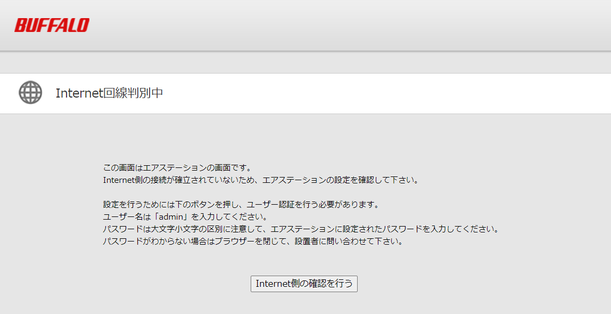
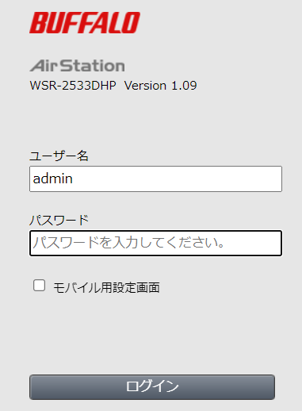
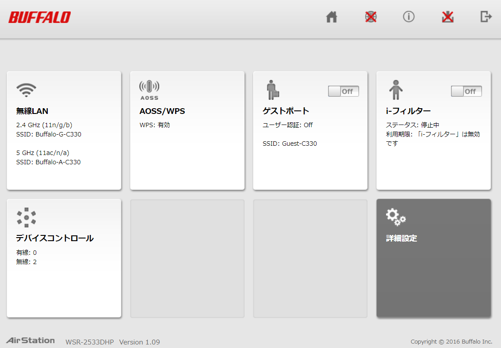
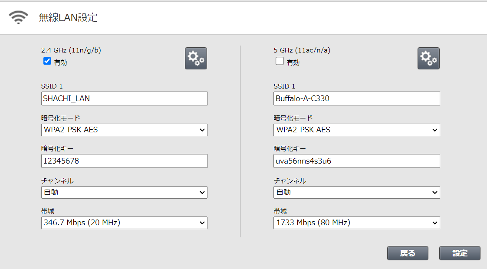
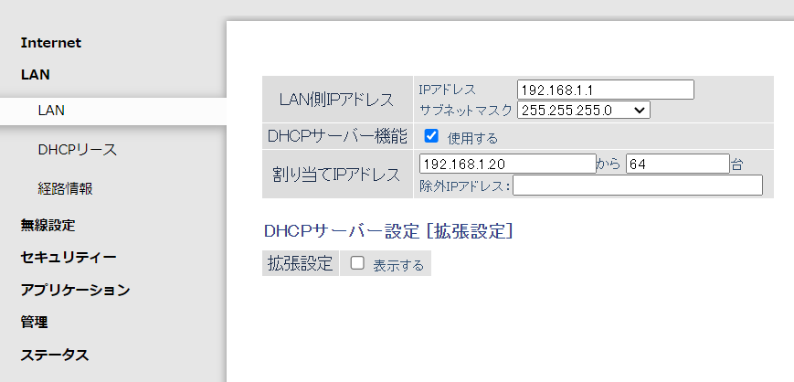

# ルーター設定  
基本的に設定は以下の通りにすればOK  

|項目|設定値|
|:-------------|:------------------|
|動作モード|ROUTOR(APはダメ)|
|ルータIPアドレス|192.168.1.1|
|DHCP|有効|
|DHCP範囲|192.168.1.20から|
|DHCP割り当て数|指定なし(ロボット台数分はあった方が良いはず)|
|無線LAN SSID|指定なし(日本語は非推奨)|
|無線LAN パスワード|12345678|
|無線LAN 暗号化|WPA2-PSK|
|使用帯域|2.4GHz|
|ステルスSSID|無効|

## 実際にやってみる  
使用するのは[WSR-2533DHP](https://www.buffalo.jp/product/series/WSR-2533DHP)。シャチホコではもっぱらバッファローの中古ルーターを使ってる  
まずはインターネットに繋がずROUTORモードで起動しPCから接続。接続するとこういう画面になる  
  
インターネット側の接続を云々を押下してログイン画面に入る、大体パスワードは"password"らしい  
  
設定画面に移動する  
  

無線LANのSSIDを分かりやすいものに変更  
パスワードを"12345678"に変更  
暗号化を"WPA2-PSK"に変更  
5GHzを無効化(2.4が使えれば良いので必須ではない)  
  

ルーター本体のIPアドレスを"192.168.1.1"に変更  
DHCPの割り当てを"192.168.1.20から"に変更  
  

ここまで変更できたら反映して終了。  
