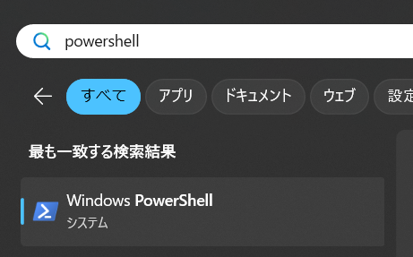
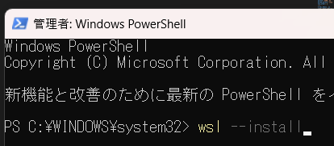
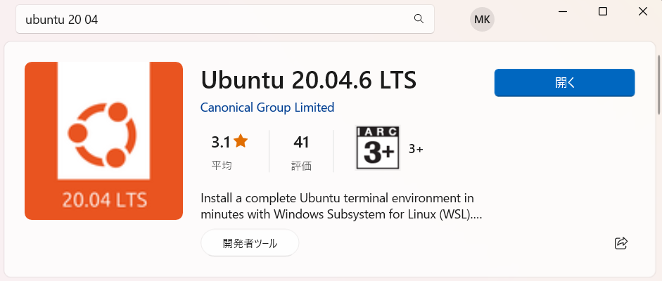
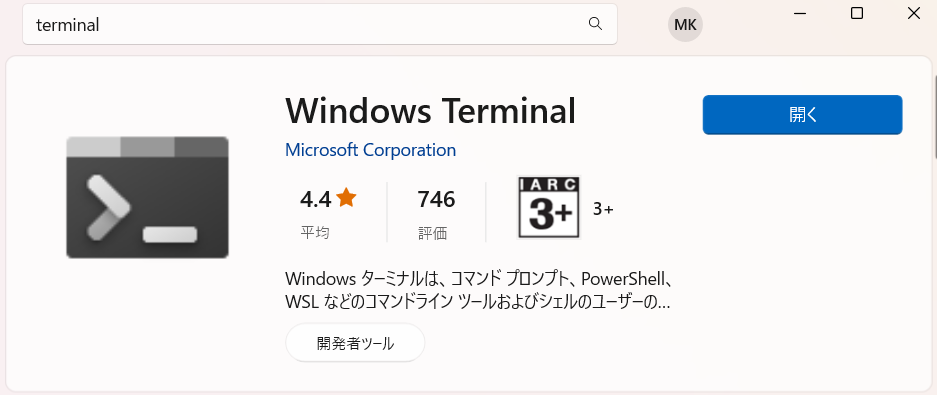
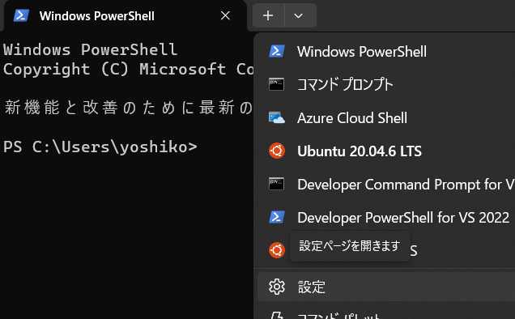
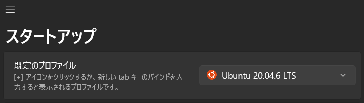

# WSL,ROSの導入  
自動照準に用いているrosをLinux機以外でも行うため、WSLの活用をしています。  
メイン機がLinuxの人は[ROSの導入](https://rm-nagoyashachihoko.github.io/TeamWiki/docs/%E5%88%B6%E5%BE%A1/%E5%90%84%E7%A8%AE%E5%B0%8E%E5%85%A5/WSL,ROS%E3%81%AE%E5%B0%8E%E5%85%A5.html#ROS%E3%81%AE%E5%B0%8E%E5%85%A5)まで飛ばしてください。  

## WSLの導入  
[公式ページ](https://learn.microsoft.com/ja-jp/windows/wsl/install)  
まずは、スタートメニューの検索欄から`powershell`と入力し、右クリックから管理者として実行する  


`wsl --install`と入力してインストール、完了したらPCを一度再起動させます  


Microsoft Storeから`Ubuntu 20.04.6 LTS`を検索して入手します。  


Windows10の場合は`Windows Terminal`もインストールを推奨します。  


これは任意だけど、Windows Terminalの規定をUbuntu20に変更する。  
タブの右側の`v`をから設定を開く。  


既定のプロファイルを`Ubuntu 20.04.06 LTS`に変更する  


これでWindowsTerminalを起動するとUbuntuが開くようになる  
Windows11ではwin+x -> i でターミナルを起動できる  
### USBデバイスの追加  
[USB デバイスを接続する - WSL](https://learn.microsoft.com/ja-jp/windows/wsl/connect-usb)を参考に設定を行うことで、RealSenseなどのUSB接続デバイスを用いることが出来る  

## ROSの導入  
[TurtleBot3のe-Manual](https://emanual.robotis.com/docs/en/platform/turtlebot3/overview/)のbashを利用する  
ターミナルを開いて以下を実行  
```
sudo apt update
sudo apt upgrade
wget https://raw.githubusercontent.com/ROBOTIS-GIT/robotis_tools/master/install_ros_noetic.sh
chmod 755 ./install_ros_noetic.sh 
bash ./install_ros_noetic.sh
sudo apt install python3-catkin-tools -y
mkdir -p ~/catkin_ws/src
cd ~/catkin_ws/
catkin init
catkin clean -y
catkin build
echo "source $HOME/catkin_ws/devel/setup.bash" >> ~/.bashrc
source ~/.bashrc
```
一行ずつやった方が(きっと)良き  

## プログラムの導入  
現状、自動照準プログラムは全て[auto_aim](https://github.com/RM-NAGOYASHACHIHOKO/auto_aim)リポジトリで管理しています。  
ワークスペースにcloneしてbuildするところまで  
```
cd ~/catkin_ws/src
git clone https://github.com/RM-NAGOYASHACHIHOKO/auto_aim
catkin build
```
