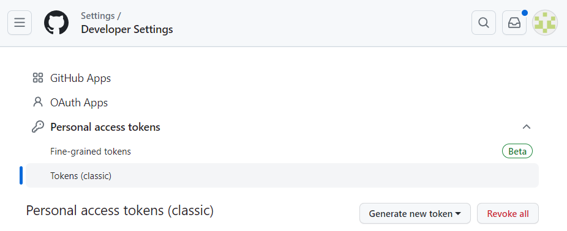
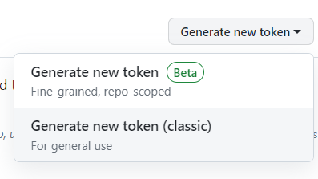
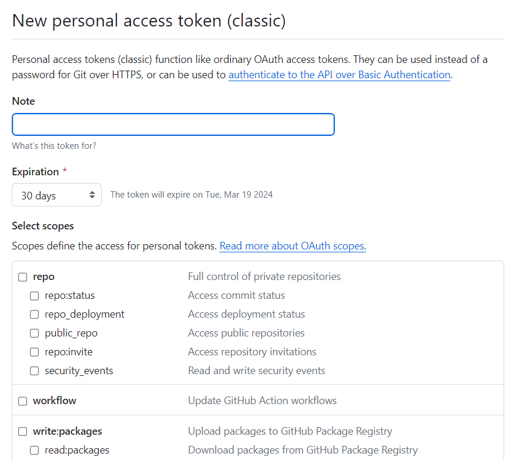

# git,githubの導入  
プログラムや基板データの管理にgit,githubを用いています。所属班に関わらず導入しましょう!  

## gitの導入  
この節はWindowsユーザー向けです。(Linuxとかは標準で入っている)  
まずは[このページ](https://gitforwindows.org/)からgitをダウンロードします。  
ダウンロードしたインストーラを実行しインストールを進めていきます。  
基本的には何も触らずNextを押してれば良いですが、下の画面  
  
は"Checkout as-is, commit as-is"を選びましょう(改行コードの自動変換を無効に出来ます。  

## gitの初期設定  
まずはターミナル(コマンドプロンプト)を開きます。(特に理由はないですが、git bashはあまり用いていません)  
**Windowsの場合**  
Windowsキーとxを同時に押します。iを押下するとターミナルが開きます。  
**Ubuntuの場合**  
CtrlとAltとTを同時押しします。

コマンドラインが起動したら、以下の内容を入力して実行します。  
```
git config --global user.name "名前"
git config --global user.email メールアドレス
```
名前とメールアドレスにところには自分のものを入れましょう。  
```
git config --list
```
を実行することで、設定の反映が確認できるはずです。  

## githubの設定  
チーム参加時に全員がgithubアカウントを持っていると思うので、アカウント作成は飛ばします。  
[アカウント作成についてはここを参照してください。](https://docs.github.com/ja/get-started/start-your-journey/creating-an-account-on-github)  
少し前からgithubへのpushにユーザー名とパスワードではなくtokenなどが必要になりました。  
ここでは"Personal access tokens"というトークンを設定する方法を紹介します。  

まずはgithubの[Developer Setting](https://github.com/settings/tokens)を開きます。  
  
Generate new tokenボタンを押下し、Generate new token (classic)を選択します。  
  

新しいトークンの設定が出来るので、入力をしていきます。  
  

Noteにはこのトークンの名称、Expiration(有効期間的な)はNO expi ration(無制限、非推奨ですが...)  
Select scopesからは有効にする権限を選択します。  
とりあえずrepoという部分にチェックをいれておけば大体大丈夫です。  
内容を確認したら最下部のGenerate tokenを押下して次に進みます。  
   
このようにtokenが表示されるので必ず記録するまでページを消さないようにします。(二度と表示できません)  

ここで出てきたtokenはpushやpullをする際に求められるPasswordに入力をします。  

tokenの平文保存はあまりお勧めできないですが、一番簡単な方法でもあります。。。  
世の中には[credential.helper](https://qiita.com/mtkhs/items/919264a9b04b9ecc5d5a)というものもあるらしいので、この辺を活用してもらうと良いかと思います。  

あと、PCが複数台あるときは端末ごとにトークンは分けた方が良い気がします(お気持ち)  