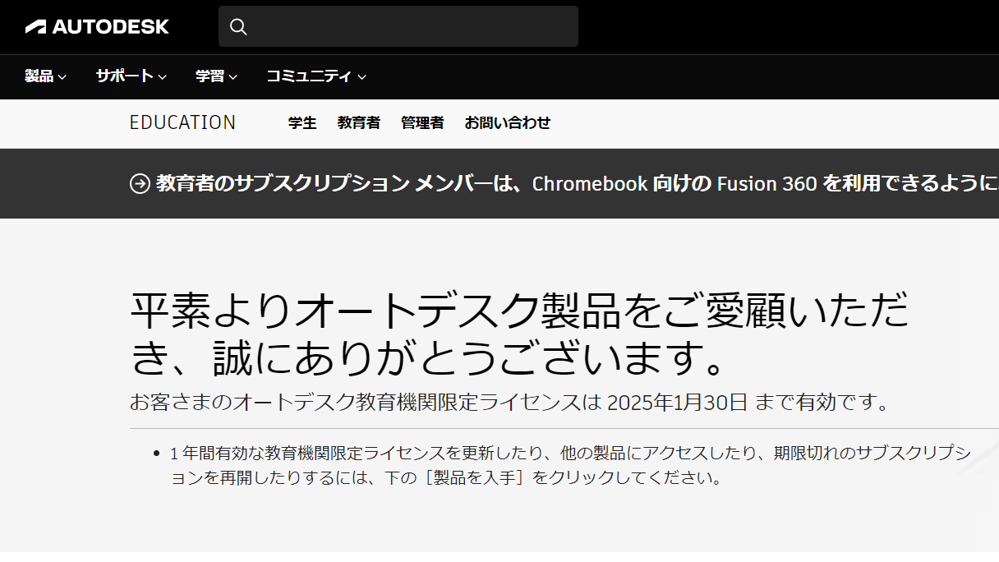
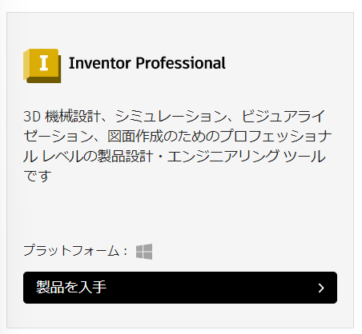
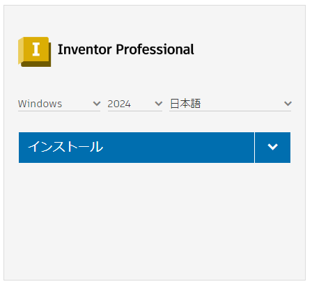
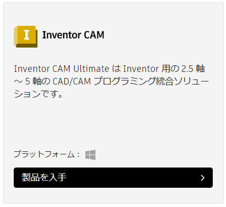
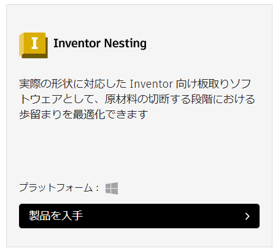
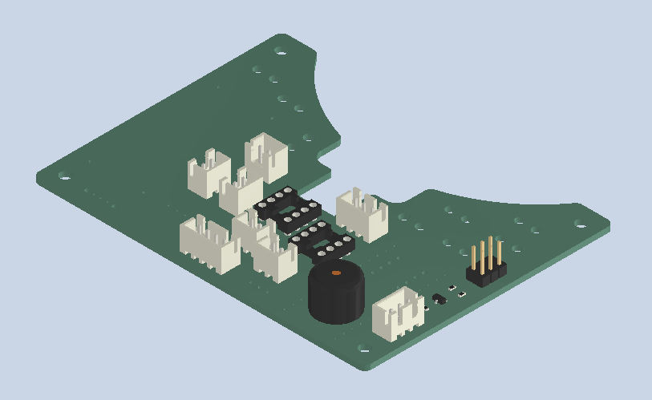
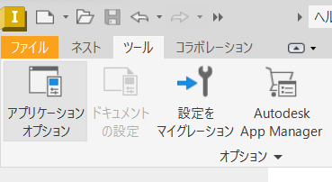
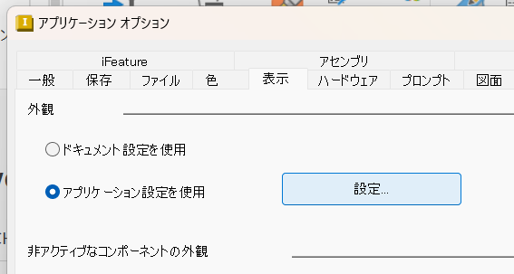
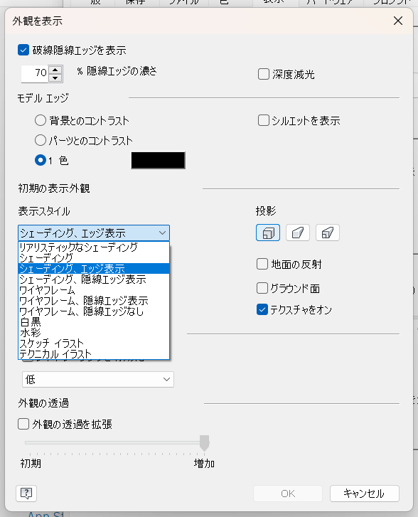
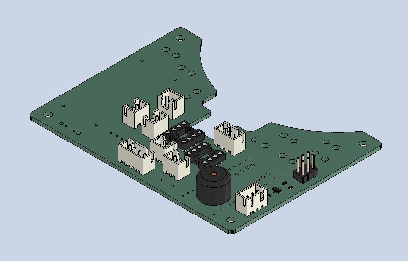

# Inventor2024  
NAGOYASHACHIHOKOでは3DCADソフトとして主に[AutodeskのInventor](https://www.autodesk.co.jp/products/inventor/overview?term=1-YEAR&tab=subscription)を用いています。(2024/2月現在)  
設計に関わる機械班メンバーだけでなく、基板の取り付けや組立て等の際にも役に立つので出来るだけ導入しておきましょう。

## 学生および教育機関の作成  
Autodeskでは学生向けのライセンスが用意されており、これを用いて年間36万のソフトを無料で使っています(感謝)  
まずはこの学生用アカウントを作成していきます。すでにアカウントを持っている人は飛ばしてください。  

まずは[教育機関限定ライセンス](https://www.autodesk.co.jp/education/edu-software/overview?sorting=featured&page=1)に飛びましょう。  
  
ページ上に"教育限定ライセンスを入手"というボタンがあるのでこちらを押下します。  
以下、説明に沿って入力を行いアカウントを作成します。(画像無し)  

数年前から認証に学生証などの証明書を提出することが必要になりました。  
名前・学校名・在学期間が表示されていることを確認して学生証等の写真をアップロードします。  

  

登録が完了し学生ライセンスの認証も完了すると[先ほどのリンク](https://www.autodesk.co.jp/education/edu-software/overview?sorting=featured&page=1)から開けるページが上の画像の様に変化します。  

## Inventor2024のインストール  
[先ほどのリンク](https://www.autodesk.co.jp/education/edu-software/overview?sorting=featured&page=1)を下にスクロールするとInventor Professionalがあるのでこちらの製品を入手をクリックします。  
  
Windows,2024,日本語が選択されていることを確認してインストールを押します。  
  
インストーラがダウンロードされてインストールが始まるので案内に従って進めてください。  

## おすすめの関連ソフト  
Inventorは標準的な3DCADの機能を持っていますが、拡張的な機能は別のアプリケーションとして用意されています。  
機械班で加工などの際に活用しているものを紹介します。  
### Inventor CAM  
  

Inventor上でCNC加工するためのGコードを生成できるCAM機能を追加するものです。  
現在は工具設定やGコードの共有などのため、[Fusion](https://www.autodesk.co.jp/campaigns/design-now)上でCAMを行っていますが、これを導入することでローカル上でCAMを行えます。  
### Inventor Nesting  
  

CNC加工やレーザー加工などで任意のサイズの材料から歩留まり良く材料を切り出すための計算が出来るソフトウェアです。  
控えめに神なので、CNCやレーザー加工機を使う機械班は必ず導入しましょう。  

## その他、Tips  
### アセンブリの表示方法について  
アセンブリは標準で"シェーディング"という表示スタイルになっています。  
  
しかし、この形式は輪郭がはっきりせず見にくいため標準で"シェーディング、エッジ表示"に変更した方が見やすいです。  
ウィンドウ上部のメニューバーから"ツール"を選択し、下のメニューから"アプリケーションオプション"を選択します。  
  
複数のタブがあるのでその中から"表示"を選んで"外観"から設定ボタンを押下します。  
  
外観を表示ウィンドウが出てくるので、この中の"初期の表示外観"から"表示スタイル"を"シェーディング、エッジ表示"に変更します  
  
これでアセンブリを開いた時のスタイルが以下のようになります。  
  